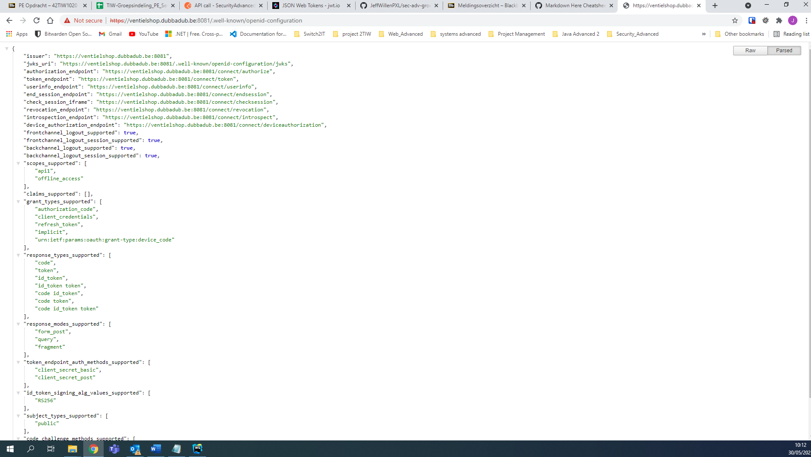
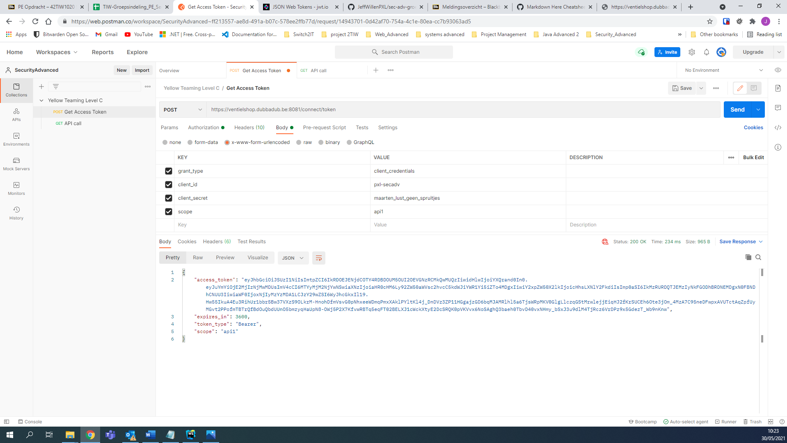
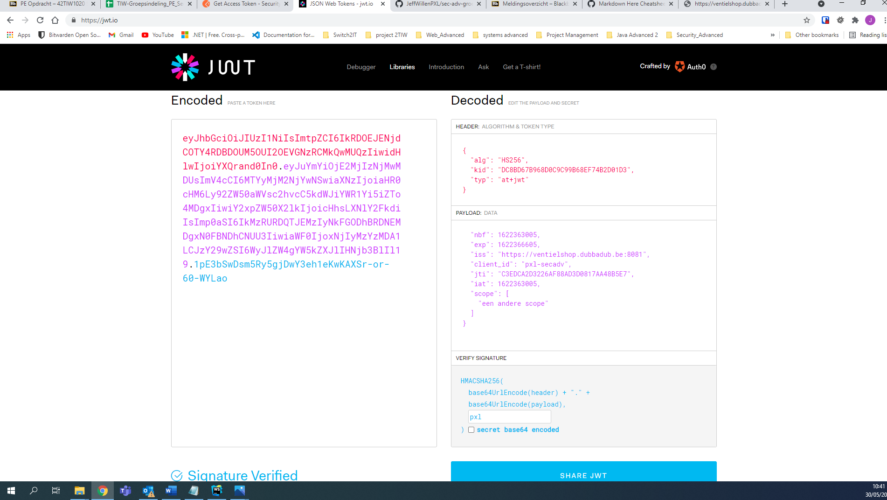
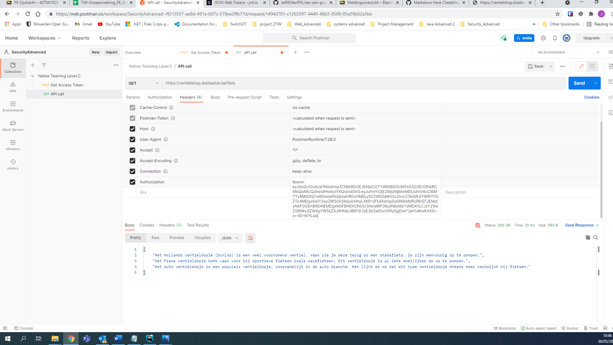

# sec-adv-groep1-yellow-teaming-level-c
In deze repository staan de app en de antwoorden op de opdrachten van Security Advanced voor het onderdeel Yellow Teaming Level C.

##Postman (deel 1)

Om een access token bij de STS server op te vragen moeten we natuurlijk weten met welke endpoint we moeten communiceren.
Deze info vinden we terug in https://ventielshop.dubbadub.be:8081/.well-known/openid-configuration

Hier vonden we de url naar de nodige eindpoint (https://ventielshop.dubbadub.be:8081/connect/token)
Nu was het mogelijk een POST-request te doen naar deze url om zo een access token op te vragen.
In de body van de POST-request gaven we volgend parameters mee:

* grant-type = client_credentials
* client_id = pxl-secadv
* client_secret = maarten_lust_geen_spruitjes
* scope = api1

Als response vekregen we een access token.

##Run client app

Voer volgende commando's uit in een terminal venster:

1. git clone https://github.com/JeffWillenPXL/sec-adv-groep1-yellow-teaming-level-c.git
2. npm install
3. node app.js

Het client programma gaat een access token opvragen bij de STS server.
Vervolgens wordt met dit access token de "/fiets" endpoint van de API aangsproken.

##Postman (deel 2)

We gaan de inhoud van onze access token inspecteren op jwt.io.
Het is de bedoeling om info van het access token aan te passen en met deze gewijzigde inhoud alsnog toegang te krijgen tot de API.
Om de inhoud te kunnen wijzigen hebben we het encryptie algoritme moeten aanpassen van RS256 naar HS256.

Vervolgens wijzigden we de issuer, client_id en scope (key = pxl) en probeerden we alsnog toegang te krijgen tot de API.
We merkten dat dit niet lukte wanneer we de issuer aanpasten, maar wel wanneer we de client_id of scope wijzigden.

vb scope wijziging

De API zou de client geen toegang meer mogen geven wanneer we de issuer aanpassen. Dit lukte ook niet, dus dit werkt correct.
Wanneer we de client_id of scope aanpasten kregen we wel nog toegang tot de API. De API controleert dus noch de scope noch de client_id.
